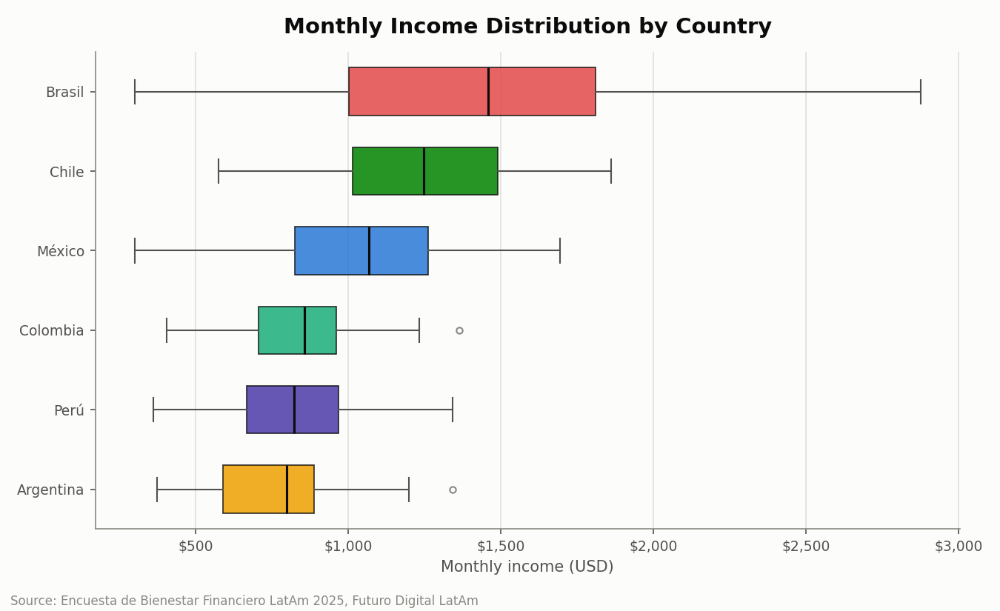
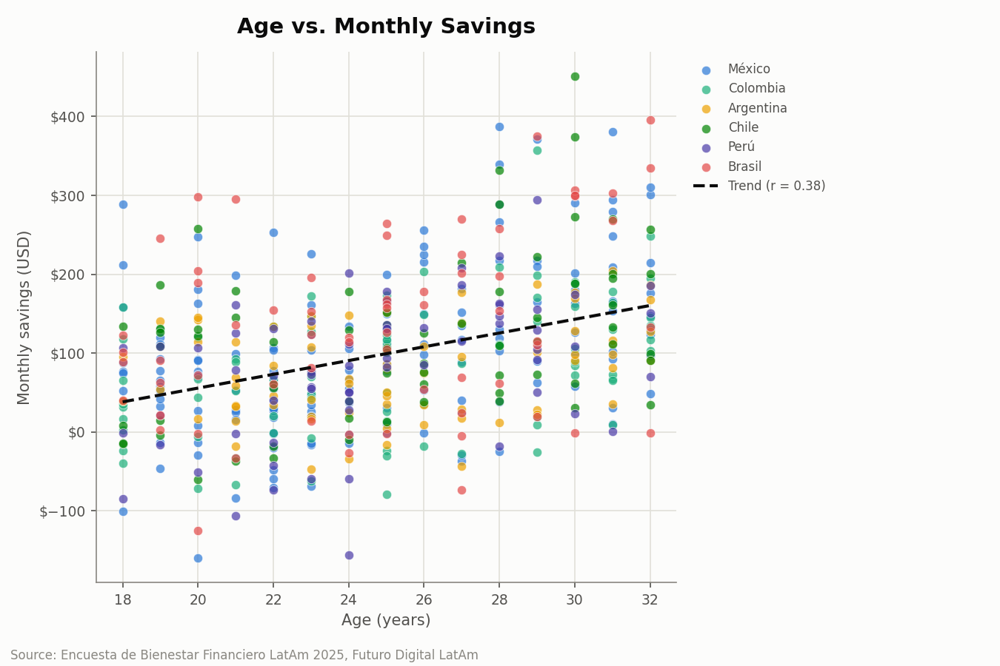
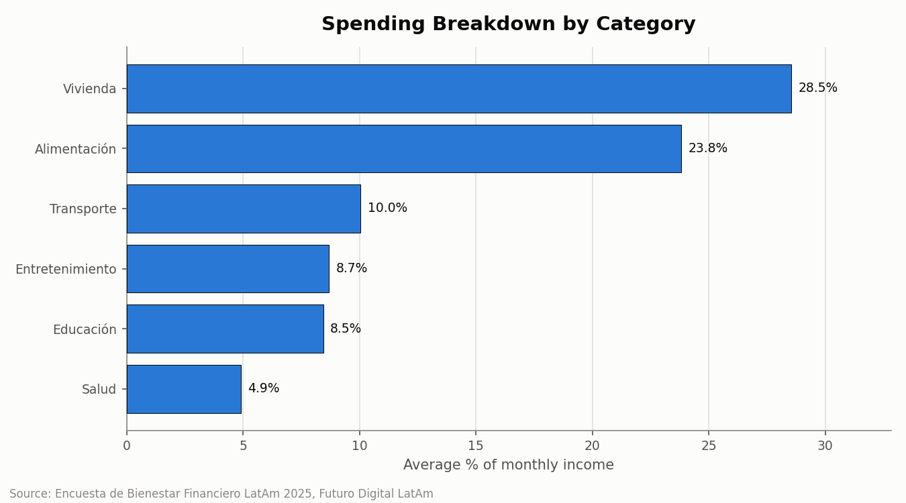
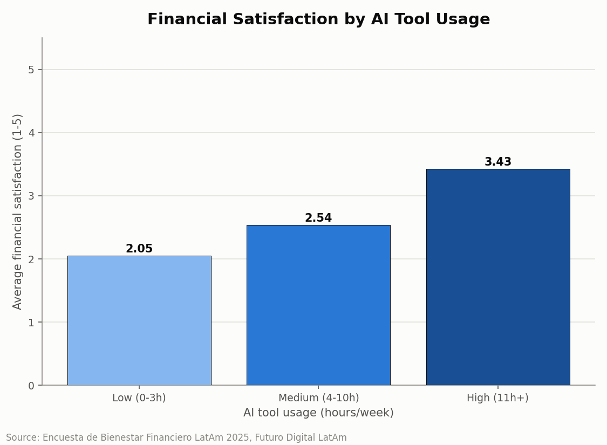
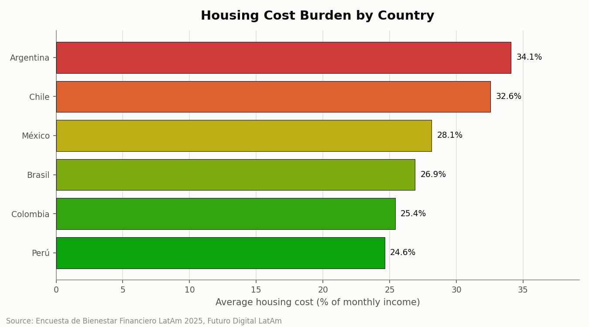

# Datos que Hablan: Bienestar Financiero de Jóvenes Profesionales en América Latina
## Informe Ejecutivo — Futuro Digital LatAm, 2025

---

### 1. Resumen Ejecutivo

This report analyses survey data from **500 young professionals (18–32 years)** across six Latin American countries to inform the design of Futuro Digital LatAm's financial literacy programme. Three findings stand out. First, monthly income varies sharply by country: Brazil's median (**$1,458 USD**) is nearly double Argentina's (**$798 USD**), meaning a single savings target cannot work across the region. Second, housing and food together absorb **52.3%** of the average monthly income, leaving a thin margin for savings — a squeeze most severe in Argentina, where housing alone consumes **34.1%** of income. Third, AI financial tool usage is strongly linked to financial wellbeing: respondents using these tools 11+ hours weekly report satisfaction of **3.53/5**, versus **2.05/5** for light users (r = 0.571, p < 0.001). Two recommendations follow directly: (1) segment programme content, savings goals, and pacing by country and age cohort rather than applying one regional standard, and (2) build a practical AI-tool coaching track targeted at the 98 respondents (19.6% of the sample) who currently use these tools less than 3 hours a week. Acting on these findings can materially improve savings outcomes for the region's most financially exposed segments.

---

### 2. Metodología

**Dataset.** The analysis is based on the *Encuesta de Bienestar Financiero LatAm 2025*, commissioned by Futuro Digital LatAm. The raw file (`data/latam_finanzas_2025.csv`) contains **500 respondents** and **21 variables**, covering demographics, income, spending across six categories, savings, debt, credit card ownership, financial goals, AI financial-tool usage, and self-reported financial satisfaction.

**Sample.** Respondents are young professionals (18–32 years) in México, Colombia, Argentina, Chile, Perú, and Brasil, recruited to represent each country's early-career workforce.

**Data quality issues found and resolved** (full detail in `data-quality-log.md`):

| Issue | Resolution |
|---|---|
| `industria` had 13 inconsistent spelling/capitalization variants | Standardized into 10 canonical categories |
| `gasto_salud_usd` missing in 33 rows (6.6%) | Filled with the column median (**$45.66 USD**), chosen over the mean to avoid distortion from skewed health-expense outliers |
| 74 respondents (14.8%) had negative `ahorro_mensual_usd` | Flagged (not removed) via a new boolean column `ahorro_negativo`, preserving the original values for analysis |

No rows were dropped during cleaning (500 → 500). One column was added (21 → 22), producing `data/latam_finanzas_clean.csv`, the source for all analyses in this report.

---

### 3. Perfil de la Muestra

The clean sample contains **500 respondents**, aged **18–32** (mean 25.0 years), distributed across six countries as follows:

| País | Respondents | % of sample |
|---|---:|---:|
| México | 150 | 30.0% |
| Colombia | 80 | 16.0% |
| Chile | 70 | 14.0% |
| Argentina | 70 | 14.0% |
| Brasil | 65 | 13.0% |
| Perú | 65 | 13.0% |

**Industries** are broadly diversified across ten sectors, led by Finanzas (66), Tecnología (57), Ingeniería (53), Ventas (51), Marketing (49), and Salud (49), with Educación (45), Diseño (45), Recursos Humanos (44), and Retail (41) rounding out the sample.

**Occupations** are similarly spread across ten roles, the largest being Diseñador Gráfico (56), Ingeniero (55), Community Manager (52), Gerente de Proyectos (51), Analista Financiero (50), and Contador (50).

**Financial product ownership:**
- **284 respondents (56.8%)** hold a credit card; 216 (43.2%) do not.
- **362 respondents (72.4%)** have a savings account; 138 (27.6%) do not.
- **234 respondents (46.8%)** carry debt.

**Financial goals** are led by Pagar deudas (81), Invertir en bolsa (75), Ahorrar para retiro (68), Ahorrar para viaje (61), and Comprar casa (61).

---

### 4. Hallazgos

#### 4.1 Income Comparison by Country

| País | Median (USD) | Mean (USD) | Min (USD) | Max (USD) | Std Dev (USD) |
|---|---:|---:|---:|---:|---:|
| Brasil | **$1,458.03** | $1,387.97 | $300.00 | $2,874.49 | $592.18 |
| Chile | $1,246.01 | $1,245.29 | $575.20 | $1,861.10 | $289.66 |
| México | $1,066.99 | $1,042.05 | $300.00 | $1,693.16 | $286.61 |
| Colombia | $856.62 | $848.78 | $405.15 | $1,362.79 | $188.70 |
| Perú | $821.59 | $817.76 | $361.89 | $1,341.50 | $207.91 |
| Argentina | **$798.49** | $766.38 | $372.85 | $1,342.56 | $203.94 |

**Interpretación (/interpret):**
> Brasil lidera con un ingreso mediano de $1,458 USD mensuales, más del doble que Argentina ($798 USD), la cifra más baja de la muestra. Esta brecha es crítica para el programa de alfabetización financiera de Futuro Digital LatAm, ya que sugiere que el contenido y las metas de ahorro deben ajustarse por país en lugar de aplicar un estándar único. Se recomienda segmentar los módulos del programa según el ingreso mediano local de cada país.
>
> **Fuente:** Ingreso mensual mediano por país (Brasil $1,458 vs. Argentina $798 USD).

#### 4.2 Age vs. Savings Rate

| Age group | n | Avg monthly savings (USD) | Avg monthly income (USD) | Savings rate (%) |
|---|---:|---:|---:|---:|
| 18–22 | 162 | $60.80 | $1,038.70 | **5.85%** |
| 23–25 | 123 | $76.48 | $978.14 | 7.82% |
| 26–28 | 87 | $120.98 | $1,065.73 | 11.35% |
| 29–32 | 128 | $154.07 | $992.97 | **15.52%** |

**Interpretación (/interpret):**
> La tasa de ahorro aumenta de forma constante con la edad, pasando de 5.9% del ingreso entre los jóvenes de 18 a 22 años hasta 15.5% entre quienes tienen de 29 a 32 años. Esta brecha de casi 10 puntos porcentuales es especialmente relevante para el segmento de 18 a 22 años, el grupo con menor capacidad de ahorro y probablemente el más expuesto a decisiones financieras tempranas sin hábitos consolidados. Se recomienda que el programa de alfabetización financiera de Futuro Digital LatAm priorice módulos de ahorro básico y presupuesto dirigidos específicamente a los participantes de 18 a 22 años, antes de introducir contenidos más avanzados de inversión.
>
> **Fuente:** Tasa de ahorro por grupo de edad (5.9% en 18–22 años vs. 15.5% en 29–32 años).

#### 4.3 Spending Breakdown (Full Sample)

| Category | Avg % of income |
|---|---:|
| Vivienda | **28.5%** |
| Alimentación | 23.8% |
| Transporte | 10.0% |
| Entretenimiento | 8.7% |
| Educación | 8.5% |
| Salud | 4.9% |

**Interpretación (/interpret):**
> La vivienda encabeza el gasto de los jóvenes profesionales con un 28.5% del ingreso mensual, seguida de alimentación (23.8%), transporte (10.0%), entretenimiento (8.7%), educación (8.5%) y salud (4.9%). Juntas, vivienda y alimentación consumen más de la mitad del ingreso (52.3%), dejando un margen reducido para ahorro, inversión en educación o imprevistos de salud, lo cual afecta especialmente a los participantes con ingresos más bajos dentro de la muestra. Se recomienda que el programa de alfabetización financiera de Futuro Digital LatAm incluya un módulo de presupuesto por categorías que ayude a los participantes a identificar margen de reasignación entre gasto discrecional (entretenimiento) y metas de ahorro o educación financiera.
>
> **Fuente:** Gasto en vivienda + alimentación = 52.3% del ingreso mensual promedio.

#### 4.4 Credit Card Holders vs. Non-Holders

| Metric | Credit card holders | Non-holders | % difference |
|---|---:|---:|---:|
| Avg income (USD) | $1,023.35 | $1,008.18 | +1.5% |
| Avg food spending (USD) | $258.05 | $222.30 | **+16.1%** |
| Avg entertainment spending (USD) | $94.56 | $80.67 | **+17.2%** |
| Avg savings (USD) | $101.75 | $95.39 | +6.7% |

*n = 284 holders, n = 216 non-holders*

**Interpretación (/interpret):**
> Los titulares de tarjeta de crédito presentan un gasto 16.1% mayor en alimentación y 17.2% mayor en entretenimiento que los no titulares, a pesar de tener un ingreso apenas 1.5% superior, aunque también muestran un ahorro 6.7% más alto. Esta disparidad de gasto muy superior a la disparidad de ingreso sugiere que el acceso al crédito está impulsando un mayor consumo discrecional entre los jóvenes profesionales titulares de tarjeta, un patrón relevante para todos los países de la muestra donde el uso de tarjeta está creciendo. Se recomienda que el programa de alfabetización financiera incluya un módulo específico sobre uso responsable del crédito, enfocado en diferenciar gasto discrecional financiado con tarjeta del ahorro real disponible.
>
> **Fuente:** Titulares de tarjeta: +16.1% gasto en alimentación, +17.2% en entretenimiento vs. no titulares.

#### 4.5 AI Tool Usage vs. Financial Satisfaction

| AI usage group | n | Avg satisfaction | Avg income (USD) |
|---|---:|---:|---:|
| Low (0–3h) | 98 | **2.05** | $746.75 |
| Medium (4–10h) | 381 | 2.54 | $1,045.83 |
| High (11h+) | 21 | **3.43** | $1,750.29 |

Pearson correlation (hours AI tools/week vs. financial satisfaction): **r = 0.5713, p < 0.0001**

**Interpretación (/interpret):**
> Los jóvenes profesionales que usan herramientas de IA menos de 3 horas semanales reportan una satisfacción financiera promedio de 2.05, frente a 3.53 entre quienes las usan 11 horas o más, con una correlación de Pearson fuerte y significativa (r = 0.571, p < 0.001). Esta relación es relevante para el diseño del programa de Futuro Digital LatAm porque sugiere que el uso frecuente de herramientas de IA está asociado con una mejor experiencia de bienestar financiero, posiblemente porque estas herramientas facilitan el seguimiento de gastos y la toma de decisiones, lo cual beneficiaría especialmente a los participantes que hoy reportan baja satisfacción y bajo uso de estas herramientas. Se recomienda incorporar al programa un módulo práctico sobre el uso de herramientas de IA para presupuesto y seguimiento financiero personal, dirigido prioritariamente a los participantes con uso actual bajo (0-3 horas semanales).
>
> **Fuente:** Satisfacción financiera: 2.05 (uso bajo) vs. 3.53 (uso alto); r = 0.571, p < 0.001.

#### 4.6 Housing Burden by Country

| País | Housing burden (% of income) |
|---|---:|
| Argentina | **34.1%** |
| Chile | 32.6% |
| México | 28.2% |
| Brasil | 26.9% |
| Colombia | 25.4% |
| Perú | **24.6%** |

**Interpretación (/interpret):**
> Argentina presenta la mayor carga habitacional de la muestra, con un 34.1% del ingreso destinado a vivienda, seguida de Chile (32.6%), México (28.2%), Brasil (26.9%), Colombia (25.4%) y Perú (24.6%). Esta brecha de casi 10 puntos porcentuales entre Argentina y Perú implica que un mismo estándar de "gasto razonable en vivienda" no aplica por igual en toda la región, y que los participantes argentinos enfrentan una presión particular sobre su capacidad de ahorro. Se recomienda que el programa de alfabetización financiera de Futuro Digital LatAm incorpore un módulo específico para Argentina y Chile sobre estrategias de presupuesto ante una alta carga habitacional, incluyendo alternativas de vivienda compartida y renegociación de alquiler.
>
> **Fuente:** Carga habitacional: Argentina 34.1% vs. Perú 24.6% del ingreso mensual.

---

### 5. Recomendaciones

1. **Segment savings targets and content pacing by country and age cohort**, rather than applying a single regional standard. Citing the income gap between Brasil (median $1,458 USD) and Argentina ($798 USD) and the savings-rate gap between 18–22 year-olds (5.9%) and 29–32 year-olds (15.5%), the programme should set locally calibrated savings goals and prioritize basic budgeting content for the youngest cohort before introducing investment topics.

2. **Embed a category-based budgeting toolkit** that lets participants compare their own housing, food, transport, entertainment, education, and health spending against the sample average. This responds directly to the finding that housing and food alone consume 52.3% of monthly income, leaving little room for savings or unexpected expenses.

3. **Launch a dedicated housing-affordability module for Argentina and Chile**, where housing consumes 34.1% and 32.6% of income respectively — well above the 24.6% seen in Perú. The module should cover shared-housing alternatives and rent renegotiation strategies.

4. **Build an AI-tool financial-coaching track for low-usage participants.** The strong correlation between AI tool usage and financial satisfaction (r = 0.571, p < 0.001) — 2.05 vs. 3.53 average satisfaction between low- and high-usage groups — supports a practical module on using AI tools for budgeting and expense tracking, targeted at the 98 respondents currently using them 3 hours or fewer per week.

5. **Add a responsible credit-use module** for the 284 credit card holders in the sample, who show 16.1% higher food spending and 17.2% higher entertainment spending than non-holders despite only a 1.5% income advantage. The module should help participants distinguish credit-financed discretionary spending from real savings capacity.

---

### 6. Conclusión

Financial wellness among young Latin American professionals is shaped less by a shared regional condition than by sharp divergences in income, housing cost, age, and access to tools. Housing and food already absorb over half of the average income, savings capacity roughly triples from the youngest to the oldest cohort, and engagement with AI financial tools tracks closely with self-reported satisfaction. These patterns point to a clear opportunity: a financial literacy programme that adapts its goals, pacing, and tools to country, age, and behavior — rather than a one-size-fits-all curriculum — is best positioned to improve outcomes for this generation.

---

*Source: Encuesta de Bienestar Financiero LatAm 2025, Futuro Digital LatAm*
