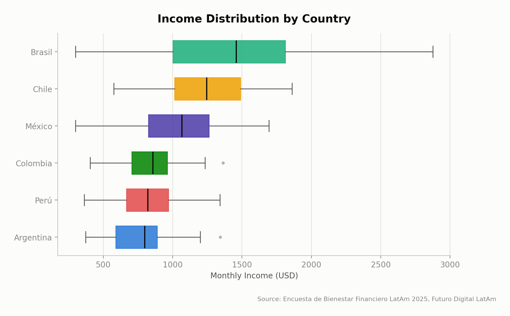
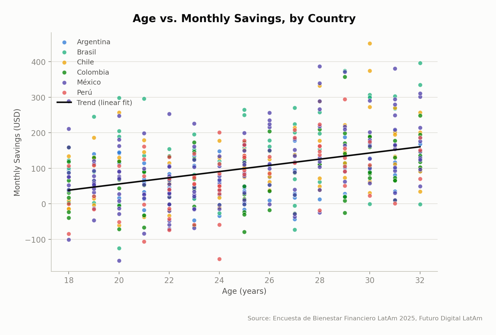
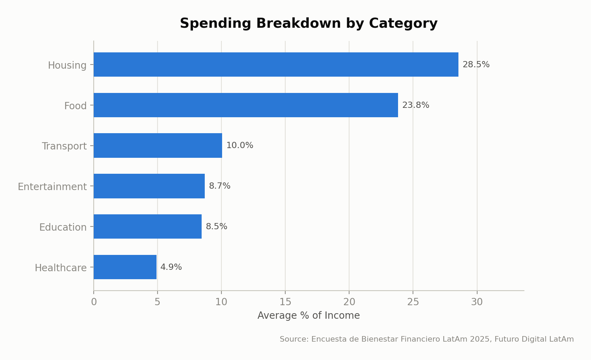
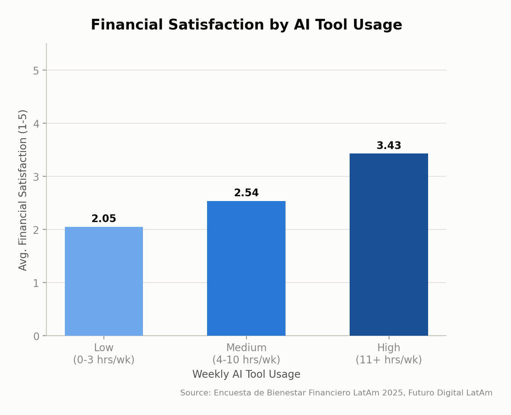
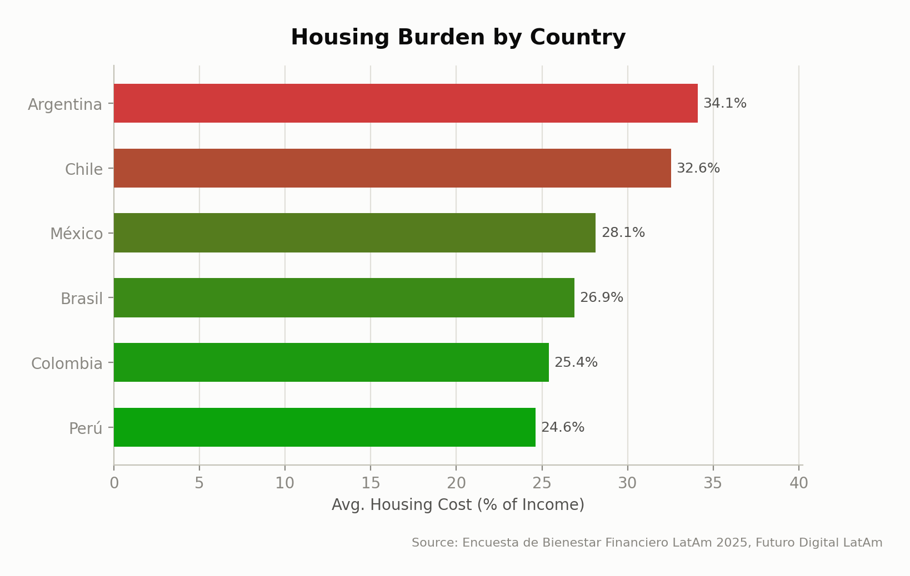

# Datos que Hablan: Bienestar Financiero de Jóvenes Profesionales en América Latina
## Informe Ejecutivo — Futuro Digital LatAm, 2025

### 1. Resumen Ejecutivo

This report analyses survey data from 500 young professionals (ages 18–32) across six Latin American countries to inform the design of Futuro Digital LatAm's financial literacy programme. Three findings stand out. First, monthly income varies nearly twofold by country, from a **$1,458** median in Brasil to just **$798** in Argentina, meaning a single regional curriculum will feel irrelevant in lower-income markets. Second, savings behaviour is strongly age-dependent: the youngest cohort (18–22) saves only **5.72%** of income versus **15.52%** for the oldest (29–32), nearly triple — habits are still forming early in careers. Third, housing and food together consume more than half of average income (**28.54%** and **23.83%** respectively), so generic "cut small purchases" advice will have limited impact. Two recommendations follow directly: (1) localise programme content and savings benchmarks by country income tier rather than applying one regional standard, and (2) prioritise a dedicated early-career savings module for 18–25 year-olds, since this is the highest-leverage window to build lasting habits before low-saving patterns become entrenched. Housing-cost strategies and responsible credit use should complement these as secondary pillars.

### 2. Metodología

- **Dataset:** Encuesta de Bienestar Financiero LatAm 2025 (Financial Wellness Survey LatAm 2025), commissioned by Futuro Digital LatAm.
- **Sample:** 500 respondents across 6 countries (México, Colombia, Argentina, Chile, Perú, Brasil), ages 18–32.
- **Data collection and processing:** Raw survey responses (21 columns) were loaded and explored in Phase 1 to check structure, data types, missing values, and outliers. Phase 2 produced a cleaned dataset (`data/latam_finanzas_clean.csv`, 500 rows, 22 columns), keeping the original raw file untouched. Phase 3 applied descriptive statistics and correlation analysis (pandas, scipy) to answer six core research questions. Phase 4 generated five charts (matplotlib/seaborn), and Phase 5 translated statistical results into plain-language findings for a non-technical audience.
- **Data quality issues found and resolved:**
  1. **Inconsistent industry labels:** the `industria` column contained 13 unique values, including 4 variants representing the same industry (e.g., "Tecnología," "Tecnologia," "tech," "TECNOLOGÍA"). These were standardised to 10 canonical categories.
  2. **Missing healthcare spending:** `gasto_salud_usd` was missing for 33 rows (6.6% of the sample). Rather than dropping these rows and losing sample size, missing values were filled with the column median ($45.66).
  3. **Negative savings values:** 74 respondents (14.8%) report negative monthly savings (spending exceeds income). These are valid data points, not data errors, and were retained; a boolean flag column (`ahorro_negativo`) was added to support downstream analysis.

### 3. Perfil de la Muestra

The sample comprises 500 respondents distributed unevenly across six countries, with México contributing the largest share:

| Country | Respondents | % of Sample |
|---|---:|---:|
| México | 150 | 30.0% |
| Colombia | 80 | 16.0% |
| Chile | 70 | 14.0% |
| Argentina | 70 | 14.0% |
| Brasil | 65 | 13.0% |
| Perú | 65 | 13.0% |

**Age:** Respondents range from 18 to 32 years old (mean = 24.96, std = 4.22), skewing toward the younger end of the range:

| Age Group | Respondents |
|---|---:|
| 18–22 | 162 |
| 23–25 | 123 |
| 26–28 | 87 |
| 29–32 | 128 |

**Industries:** Ten industries are represented, led by Finanzas (66), Tecnología (57), Ingeniería (53), Ventas (51), and Marketing (49), with Salud (49), Educación (45), Diseño (45), Recursos Humanos (44), and Retail (41) rounding out the sample.

**Occupations:** The ten most common roles are Diseñador Gráfico (56), Ingeniero (55), Community Manager (52), Gerente de Proyectos (51), Analista Financiero (50), Contador (50), Representante de Ventas (49), Coordinador de Marketing (47), Especialista en RRHH (47), and Docente (43) — indicating a broad mix of technical, creative, and administrative professions rather than concentration in a single field.

### 4. Hallazgos

#### 4.1 Income differences across countries

Median monthly income varies nearly twofold across the six countries surveyed: **$1,458** in Brasil and **$1,246** in Chile, versus **$857** in Colombia, **$822** in Perú, and **$798** in Argentina. This gap matters because a "one-size-fits-all" curriculum will feel irrelevant in lower-income markets, where budgeting advice needs to start from tighter margins and different savings benchmarks. Futuro Digital LatAm should localise programme content and savings targets by country tier rather than applying a single regional benchmark across all six markets.

#### 4.2 Age and savings behaviour

Savings rates rise sharply with age: the youngest cohort (18–22) saves an average of just **5.72%** of income (**$61/month**), while the oldest cohort (29–32) saves **15.52%** (**$154/month**) — nearly triple the rate. This suggests financial habits are still forming in the early-career years, making that window the highest-leverage moment to intervene before low-saving patterns become entrenched. The programme should prioritise a dedicated "first five years of work" savings module targeted at 18–25 year-olds, focused on building the habit early rather than correcting it later.

#### 4.3 Spending breakdown

Housing (**28.54%** of income) and food (**23.83%**) together consume more than half of the average respondent's income, dwarfing transport (**10.05%**), entertainment (**8.69%**), education (**8.45%**), and healthcare (**4.90%**). Because these two categories are largely fixed and non-discretionary, standard "cut back on small purchases" advice will have limited impact for most participants. Programme content should instead focus on housing-cost strategies (roommates, location trade-offs, negotiating rent) and food budgeting, since these are the two levers with the greatest potential effect on household finances.

#### 4.4 Credit card holders vs. non-holders

Credit card holders earn only marginally more than non-holders (**1.5%** higher income) but spend **16%** more on food and **17%** more on entertainment, while still saving slightly more overall (**6.7%** higher savings). This indicates credit access is associated with higher discretionary spending without a proportional income increase — a pattern that carries debt risk if not paired with financial discipline. The programme should include a specific module on responsible credit card use for young professionals who are about to acquire their first card, emphasising the gap between spending capacity and actual income. *(No dedicated chart; based on the Phase 3 comparison table of holders vs. non-holders.)*

#### 4.5 AI tool usage and financial satisfaction

Financial satisfaction rises consistently with AI tool usage: from **2.05** (satisfaction scale) among low users (0–3 hrs/week) to **2.54** among medium users to **3.43** among high users (11+ hrs/week) — a moderate positive correlation (**r = 0.571, p < 0.001**). However, average income also rises sharply across the same groups ($747 → $1,046 → $1,750), meaning higher earners may simply have more time and resources to use these tools — this is a correlation, not proof that AI tools cause higher satisfaction. Futuro Digital LatAm should pilot AI-assisted budgeting tools with a lower-income cohort specifically to test whether the relationship holds once income is controlled for, before investing heavily in AI-tool literacy as a core programme pillar.

#### 4.6 Housing burden by country

Housing consumes a strikingly different share of income by country: **34.09%** in Argentina and **32.55%** in Chile, versus **24.63%** in Perú and **25.41%** in Colombia — roughly a 10-percentage-point gap between the most and least burdened markets. This means Argentine and Chilean participants have structurally less room in their budgets for savings and other goals, regardless of financial literacy, and generic savings targets will be unrealistic there. The programme should set country-adjusted savings goals and, for Argentina and Chile specifically, prioritise content on housing-cost mitigation (shared housing, subsidy access) rather than assuming the shortfall is purely behavioural.

### 5. Recomendaciones

1. **Localise the curriculum and savings benchmarks by country income tier**, rather than applying one regional standard. Median income ranges from $798 (Argentina) to $1,458 (Brasil) (Finding 4.1), and housing burden ranges from 24.63% (Perú) to 34.09% (Argentina) of income (Finding 4.6) — both require country-adjusted targets, not a single regional benchmark.

2. **Launch a dedicated early-career savings module for 18–25 year-olds** as the flagship intervention. Savings rates nearly triple between the youngest and oldest cohorts (5.72% vs. 15.52% of income, Finding 4.2), indicating the early-career window is the highest-leverage moment to build lasting habits.

3. **Reframe budgeting content around housing and food, not discretionary "small purchases."** These two categories alone consume 52.4% of average income (Finding 4.3), so effective content must address rent negotiation, shared housing, and food budgeting rather than generic spending-cut advice.

4. **Introduce a responsible credit card use module** for professionals approaching their first card. Credit card holders spend 16–17% more on food and entertainment despite only marginally higher income (Finding 4.4), signalling a debt-risk pattern that structured guidance can pre-empt.

5. **Pilot AI-assisted budgeting tools with an income-controlled, lower-income cohort before scaling.** While AI tool usage correlates with higher financial satisfaction (r = 0.571, Finding 4.5), income rises in parallel across usage groups, so the causal effect must be tested directly before AI literacy becomes a core programme pillar.

### 6. Conclusión

The data show that financial wellness among young Latin American professionals is shaped as much by structural conditions — country-level income, housing costs, and career stage — as by individual financial behaviour. Savings habits form early and diverge sharply by age, housing and food dominate budgets in ways generic advice cannot fix, and apparent digital-tool benefits are entangled with income. A single regional programme cannot serve all six markets equally. Futuro Digital LatAm's greatest impact will come from a differentiated curriculum: localised by country, front-loaded for early-career professionals, and grounded in the two expense categories — housing and food — that most determine financial outcomes.
